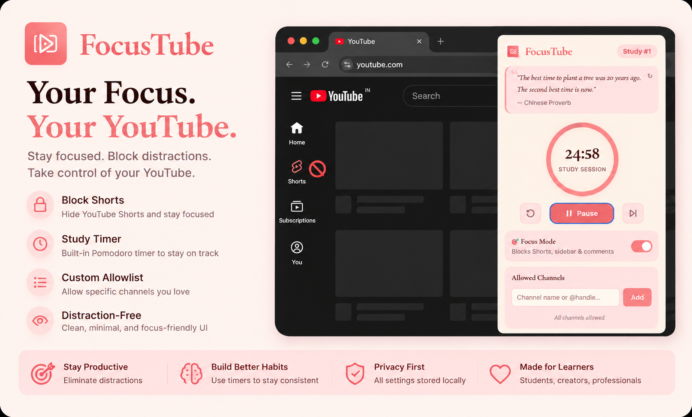
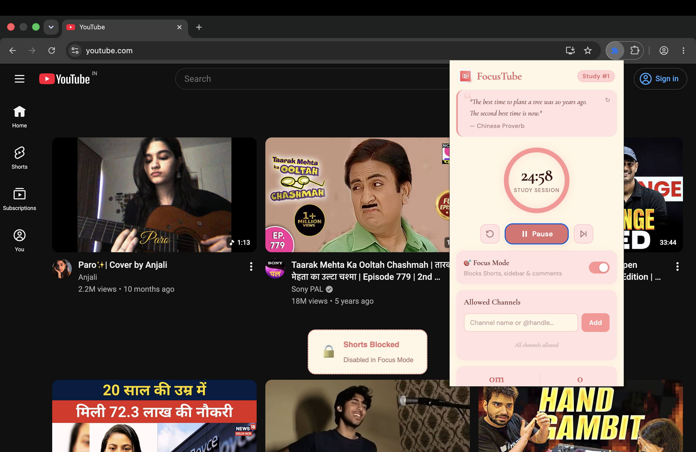
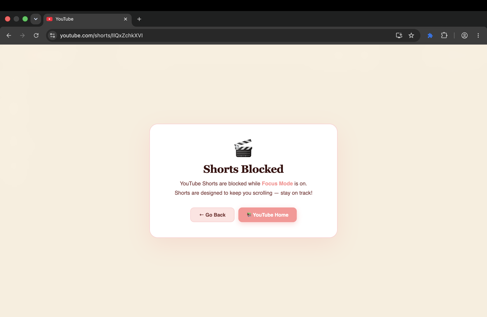
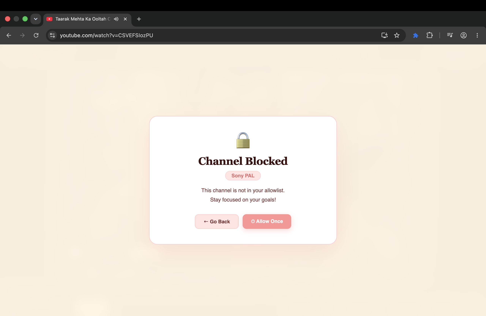
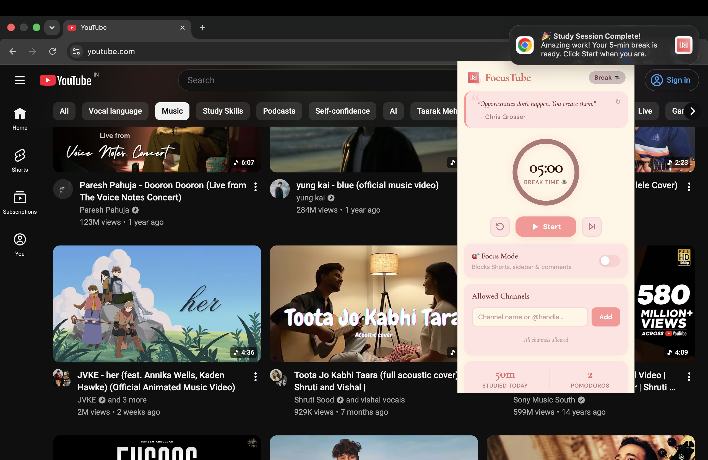

# 🎯 FocusTube

> Transform YouTube into a distraction-free learning platform — Pomodoro timer, distraction blocker & daily stats.



---

## ✨ Features

| Feature | Description |
|---|---|
| 🍅 **Pomodoro Timer** | 25-min study / 5-min break with visual ring progress |
| 🔔 **Session Notifications** | Desktop alert when study or break session ends |
| ▶️ **Start / Pause / Resume** | Pause mid-session and resume exactly where you left off |
| ⏭️ **Skip Session** | Jump to next session instantly |
| 🎯 **Focus Mode** | Hides Shorts, sidebar recommendations & comments |
| 🔒 **Shorts Blocker** | Full-page overlay on `/shorts/*`; shelf banner on homepage |
| 📺 **Channel Allowlist** | Only allow specific channels when Focus Mode is on |
| 📊 **Daily Stats** | Tracks study minutes and completed Pomodoros per day |
| 💬 **Motivational Quotes** | 40+ quotes, refresh anytime |

---

## 📸 Screenshots

### Popup UI


### Focus Mode – Shorts Blocked


### Channel Blocked


### Session Complete Notification


---

## 🚀 How to Install (Developer Mode)

1. **Clone / Download** this repo
2. Open Chrome → `chrome://extensions/`
3. Enable **Developer Mode** (top-right toggle)
4. Click **"Load unpacked"**
5. Select the `FocusTube/` folder
6. The 🎯 icon will appear in your toolbar — pin it!

---

## 🗂️ Project Structure

```
FocusTube/
├── manifest.json               # Extension config (MV3)
├── background/
│   └── service-worker.js       # Pomodoro timer engine, alarms, notifications
├── content/
│   ├── youtube.js              # Runs on YouTube — focus mode, blocking
│   └── styles.css              # Overlay & focus-mode CSS injected into YouTube
├── popup/
│   ├── popup.html              # Extension popup UI
│   ├── popup.css               # Popup styles (palette: cream/blush/rose/coral)
│   └── popup.js                # Popup logic — timer display, settings
├── icons/
│   ├── icon16.png
│   ├── icon48.png
│   └── icon128.png
└── README.md
```

---

## 🎨 Design Palette

| Name | Hex |
|---|---|
| Cream | `#FFF5E4` |
| Blush | `#FFE3E1` |
| Rose  | `#FFD1D1` |
| Coral | `#FF9494` |

**Fonts:** Cormorant Garamond (headings) + DM Sans (body)

---

## ⚙️ How It Works

### Pomodoro Timer (Service Worker)
- Runs as a **Chrome Service Worker** — persists even when popup is closed
- Uses `chrome.alarms` (fires every minute) to check elapsed time
- Timer state is stored in `chrome.storage.local`:
  ```json
  {
    "isRunning": true,
    "mode": "study",
    "remainingSeconds": 1200,
    "startedAt": 1719648000000
  }
  ```
- When you **pause**, `remainingSeconds` is saved. When you **resume**, the countdown continues from that exact point.
- When session ends → a desktop notification is created reliably, then the next session loads (not auto-started).

### Focus Mode (Content Script)
- Adds `.ft-focus-mode` class to `<html>` → CSS rules hide Shorts nav, sidebar, comments.
- A `MutationObserver` watches for dynamically injected Shorts shelves and blocks them in real time.
- On `/shorts/*` pages, a full-screen overlay is shown and the navigation buttons fall back to YouTube home when history back is unavailable.
- Channel allowlist is checked on watch/channel pages — blocked channels show a full overlay.

---

## 🧑‍💻 Tech Stack

- **Manifest V3** Chrome Extension
- Vanilla JS (no frameworks)
- CSS custom properties + Cormorant Garamond / DM Sans fonts
- `chrome.alarms`, `chrome.storage.local`, `chrome.notifications`

---

## 📝 License

MIT — free to use and modify.

---

*Made with ♥ for focused learners.*
